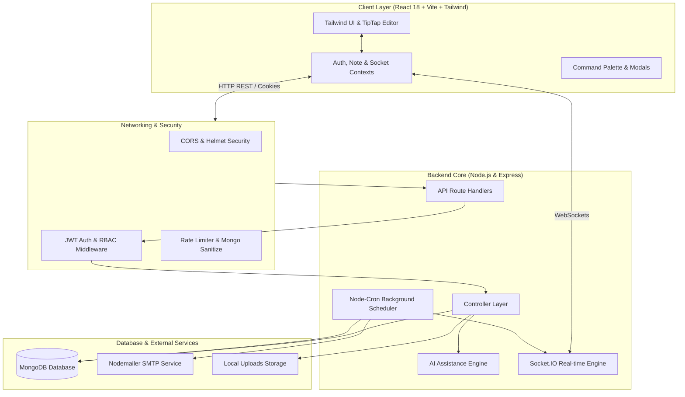

# 🚀 NoteFlow — Next-Gen Smart Notes Management Platform

<div align="center">


**An intelligent, enterprise-grade, secure, and collaborative notes management ecosystem powered by MERN, TipTap, Socket.IO, and AI.**

[](https://reactjs.org/)
[](https://nodejs.org/)
[](https://expressjs.com/)
[](https://www.mongodb.com/)
[](https://socket.io/)
[](https://tailwindcss.com/)
[](https://tiptap.dev/)
[](https://jestjs.io/)
[](https://opensource.org/licenses/MIT)

[Features](#-core-features) • [System Architecture](#-system-architecture) • [Tech Stack](#-technology-stack) • [Getting Started](#-getting-started) • [Environment Variables](#-environment-configuration) • [API Reference](#-complete-rest-api-documentation) • [WebSockets](#-real-time-socketio-events) • [Security](#-security--data-protection)

</div>

---

## 📖 Overview

**NoteFlow** is a modern, high-performance Smart Notes Management Platform designed for individuals, power users, and teams. It merges rich-text documentation with native AI assistance, real-time collaboration, scheduled reminders, folder-tag taxonomies, and multi-format data portability into a clean, responsive UI with dark/light themes and keyboard-first command palette navigation.

---

## ✨ Core Features

### 1. 📝 TipTap-Powered Rich Text Editor
- **Full Markdown & WYSIWYG Support**: Headings (H1–H3), Blockquotes, Code Blocks with syntax highlight styling, Task Checklists, Tables (with row/column manipulations), Text Colors, and Highlight markers.
- **Smart Debounced Auto-Save**: Real-time status indicator (`Typing...` ➔ `Saving...` ➔ `Saved ✓`).
- **Word & Character Analytics**: Live calculation of word count, character count, and estimated reading time.
- **Attachments & Media**: Integrated file and image upload support.

### 2. 🤖 AI Writing & Knowledge Suite
- **⚡ AI Summarize**: Instant key-takeaway and bullet-point extraction from complex documents.
- **✨ AI Generate**: Generates structured, comprehensive notes and implementation checklists from prompts.
- **✍️ AI Rewrite**: Enhances tone, fixes grammar, condenses lengthy paragraphs, or formats into an executive summary.
- **💬 AI Ask Note**: Context-aware Q&A directly answers questions based on note contents.

### 3. 📂 Organization, Taxonomy & Search
- **Color-Coded Folders & Categories**: Organize notes into structured categories with custom color palettes and icons.
- **Smart Tagging System**: Multi-tag assignment with instant tag-based filtering and aggregate usage counts.
- **Instant Search Engine**: Debounced full-text search indexing title, HTML content, tags, and categories.
- **Lifecycle States**: Pin 📌 important notes, Favorite ⭐ priority documents, Archive 📁 inactive notes, and Trash 🗑️ with soft delete.

### 4. ⏰ Automated Reminders & Cron Scheduling
- **Granular Scheduling**: Schedule date/time alerts for critical notes and action items.
- **Multi-Channel Dispatch**: Simultaneous in-app real-time alerts via Socket.IO and automated notification emails via Nodemailer.
- **Auto-Purge Background Worker**: Automated daily cron jobs that permanently clean trashed notes past 30 days and clear expired sessions.

### 5. 🤝 Real-Time Collaboration & Sharing
- **Granular User Sharing**: Share notes with registered users with explicit `VIEWER` or `EDITOR` permissions.
- **Public Shareable Links**: Generate public links with optional **Password Protection** and **Expiration Dates**.
- **Real-Time Presence**: Socket.IO collaborative presence notifications and active editor indicators.
- **Abuse Moderation**: Built-in reporting mechanism on shared and public notes for administrator review.

### 6. 📊 Analytics, Activity Timeline & Data Portability
- **Activity Stream**: Comprehensive audit trail logging logins, note creation, updates, sharing, and deletions.
- **Interactive Analytics**: Visual velocity charts using Recharts (notes created over time, category distributions, word count metrics).
- **Universal Data Export**: One-click complete account backups in **JSON**, **Markdown (.md)**, or **Plain Text (.txt)** formats.
- **Bulk Import**: Restore notes seamlessly from JSON backups and Markdown files.

### 7. 🛡️ Role-Based Access Control (RBAC) & Admin Portal
- **User vs Admin Roles**: Secure role segregation.
- **Admin Management Hub**: System-wide statistics (user counts, notes volume, storage metrics), user status management (activate/suspend/delete), and content report moderation workflow.

---

## 🏛️ System Architecture



---

## 💻 Technology Stack

| Domain | Technology | Description |
| :--- | :--- | :--- |
| **Frontend Framework** | React 18 (Vite) | Fast, modular component architecture |
| **Styling & Icons** | Tailwind CSS + Lucide React | Modern utility-first UI & clean iconography |
| **Rich Text Editor** | TipTap Editor | Headless extensible WYSIWYG editor framework |
| **Data Visualization**| Recharts | Interactive SVG chart components |
| **Backend Runtime** | Node.js & Express.js | High-throughput REST API server |
| **Database & ODM** | MongoDB & Mongoose | Flexible NoSQL document database |
| **Real-time Engine** | Socket.IO | Bi-directional event-driven communication |
| **Background Tasks** | Node-Cron | Periodic cron task scheduling & auto-purging |
| **Email Service** | Nodemailer | SMTP transactional email dispatcher |
| **Security & Auth** | JWT + HTTP-Only Cookies + Bcrypt | Multi-device session & brute-force protection |
| **API Sanitization** | Helmet + Mongo-Sanitize + RateLimit | Comprehensive HTTP headers & injection defense |
| **Testing** | Jest + Supertest | Automated integration and controller testing |

---

## 📂 Project Structure

```
Smart-Notes-Management-Platform/
├── client/                          # Frontend React (Vite) Application
│   ├── public/                      # Static assets & favicon
│   ├── src/
│   │   ├── components/
│   │   │   ├── common/              # Navbar, Sidebar, CommandPalette, Notifications
│   │   │   ├── editor/              # TipTapEditor & Toolbar controls
│   │   │   ├── modals/              # Share, Category, Tag, Reminder, Import/Export modals
│   │   │   └── notes/               # NoteCard, NoteGrid, NoteModal
│   │   ├── context/                 # AuthContext, NoteContext, SocketContext, ThemeContext
│   │   ├── pages/                   # Dashboard, Notes, Analytics, Admin, Trash, Auth pages
│   │   ├── App.jsx                  # Main routing & layout structure
│   │   ├── main.jsx                 # Vite client entrypoint
│   │   └── index.css                # Tailwind global stylesheet
│   ├── index.html                   # HTML template
│   ├── tailwind.config.js           # Tailwind design tokens & themes
│   └── vite.config.js               # Vite bundler configuration
│
├── server/                          # Backend Node.js Express API Server
│   ├── config/
│   │   └── db.js                    # MongoDB Mongoose connection
│   ├── controllers/                 # Business logic & route handlers
│   │   ├── activityController.js    # Activity audit logs
│   │   ├── adminController.js       # Admin panel & moderation
│   │   ├── aiController.js          # AI processing logic
│   │   ├── attachmentController.js  # File uploads
│   │   ├── authController.js        # Authentication & sessions
│   │   ├── categoryController.js    # Folder categories
│   │   ├── importExportController.js# Data backup & restoration
│   │   ├── noteController.js        # CRUD & Note lifecycle
│   │   ├── notificationController.js# In-app notifications
│   │   ├── reminderController.js    # Scheduled reminders
│   │   ├── shareController.js       # Public & user sharing
│   │   └── tagController.js         # Tags taxonomy
│   ├── middleware/                  # JWT auth, RBAC, Rate-limiting, Error handler
│   ├── models/                      # Mongoose schemas (User, Note, Session, Reminder, etc.)
│   ├── routes/                      # Express route endpoints
│   ├── services/                    # AI Engine & Background Job Scheduler
│   ├── sockets/                     # Socket.IO connection & event handlers
│   ├── utils/                       # JWT helper & Nodemailer configuration
│   ├── uploads/                     # Local file attachments directory
│   ├── app.js                       # Express app configuration & middleware pipeline
│   └── server.js                    # Server bootstrap & HTTP/WS listener
│
└── README.md                        # Project documentation
```

---

## ⚡ Getting Started

### Prerequisites
Make sure you have the following installed on your machine:
- **Node.js**: v18.0.0 or higher ([Download Node.js](https://nodejs.org/))
- **npm** (v9+) or **yarn** / **pnpm**
- **MongoDB**: Local instance running at `mongodb://localhost:27017` or a cloud [MongoDB Atlas](https://www.mongodb.com/cloud/atlas) cluster URI.

---

### 1. Clone the Repository
```bash
git clone https://github.com/hanzlashahzad01/Smart-Notes-Management-Platform.git
cd Smart-Notes-Management-Platform
```

---

### 2. Backend Server Setup

1. Navigate to the server folder:
   ```bash
   cd server
   ```

2. Install server dependencies:
   ```bash
   npm install
   ```

3. Create a `.env` file in the `server` directory (refer to [Environment Configuration](#-environment-configuration)):
   ```bash
   cp .env.example .env   # Or create .env manually
   ```

4. Start the backend in development mode:
   ```bash
   npm run dev
   ```
   *The server will start at `http://localhost:5000` with WebSocket listeners active.*

---

### 3. Frontend Client Setup

1. Open a new terminal and navigate to the client folder:
   ```bash
   cd client
   ```

2. Install client dependencies:
   ```bash
   npm install
   ```

3. Start the Vite development server:
   ```bash
   npm run dev
   ```
   *The client will be running at `http://localhost:5173`.*

---

## ⚙️ Environment Configuration

Create a `.env` file inside the `server/` root directory:

```env
# ==========================================
# NoteFlow Server Environment Configuration
# ==========================================

# Server Port & Mode
PORT=5000
NODE_ENV=development

# Database Connection
MONGO_URI=mongodb://127.0.0.1:27017/noteflow

# Frontend Client URL (For CORS & Magic Links)
CLIENT_URL=http://localhost:5173

# JWT Authentication Secrets
JWT_SECRET=your_super_secret_access_jwt_key_2026_change_in_production
JWT_REFRESH_SECRET=your_super_secret_refresh_jwt_key_2026_change_in_production

# Email Service (Nodemailer SMTP)
# Leave EMAIL_USER/EMAIL_PASS empty to use built-in console simulator in dev mode
EMAIL_HOST=smtp.gmail.com
EMAIL_PORT=587
EMAIL_USER=your_email@gmail.com
EMAIL_PASS=your_app_specific_password
```

---

## 📚 Complete REST API Documentation

### 🔐 Authentication & Session Endpoints (`/api/auth`)

| Method | Endpoint | Access | Description |
| :--- | :--- | :--- | :--- |
| `POST` | `/api/auth/register` | Public | Register new user, create session, issue cookies |
| `POST` | `/api/auth/login` | Public | Authenticate user credentials & issue JWT tokens |
| `POST` | `/api/auth/logout` | Protected | Invalidate current session & clear cookies |
| `POST` | `/api/auth/logout-all` | Protected | Invalidate all active sessions for the user |
| `POST` | `/api/auth/refresh` | Public | Rotate refresh token & issue new access token |
| `GET` | `/api/auth/me` | Protected | Fetch current authenticated user profile |
| `PUT` | `/api/auth/profile` | Protected | Update profile information (name, avatar, theme) |
| `PUT` | `/api/auth/change-password` | Protected | Change password with current password verification |
| `POST` | `/api/auth/forgot-password` | Public | Send password reset email token |
| `POST` | `/api/auth/reset-password` | Public | Reset password using reset token |
| `GET` | `/api/auth/sessions` | Protected | Retrieve all active login sessions/devices |
| `GET` | `/api/auth/verify-email` | Public | Verify user account email |

---

### 📝 Notes & Management (`/api/notes`)

| Method | Endpoint | Access | Description |
| :--- | :--- | :--- | :--- |
| `GET` | `/api/notes` | Protected | Fetch notes (supports search, category, tag, & status filters) |
| `POST` | `/api/notes` | Protected | Create a new note |
| `GET` | `/api/notes/:id` | Protected | Retrieve single note by ID (checks ownership/sharing) |
| `PUT` | `/api/notes/:id` | Protected | Update note title, content, tags, category, or pin status |
| `DELETE` | `/api/notes/:id` | Protected | Move note to Trash (soft delete) |
| `PATCH` | `/api/notes/:id/restore` | Protected | Restore note from Trash |
| `DELETE` | `/api/notes/:id/permanent` | Protected | Permanently delete note and its attachments |
| `POST` | `/api/notes/:id/duplicate` | Protected | Create a duplicate copy of an existing note |
| `GET` | `/api/notes/dashboard/stats` | Protected | Get personal analytics & note velocity metrics |

---

### 🤖 AI Writing Assistant (`/api/ai`)

| Method | Endpoint | Access | Description |
| :--- | :--- | :--- | :--- |
| `POST` | `/api/ai/summarize` | Protected | Extract concise bullet points and takeaways from note text |
| `POST` | `/api/ai/generate` | Protected | Generate a structured note and checklist based on a prompt |
| `POST` | `/api/ai/rewrite` | Protected | Rewrite text (modes: `professional`, `shorter`, `grammar`) |
| `POST` | `/api/ai/ask` | Protected | Ask interactive contextual questions about note content |

---

### 🤝 Sharing & Public Links (`/api/shares`)

| Method | Endpoint | Access | Description |
| :--- | :--- | :--- | :--- |
| `POST` | `/api/shares/share` | Protected | Share note with a user by email (`VIEWER` / `EDITOR`) |
| `DELETE`| `/api/shares/unshare` | Protected | Revoke user access from a shared note |
| `POST` | `/api/shares/public-link` | Protected | Enable/disable public link, set password & expiry date |
| `POST` | `/api/shares/public/:shareLink`| Public | View public note (requires password verification if set) |
| `POST` | `/api/shares/report` | Protected | Report inappropriate note content for moderation |

---

### 📁 Categories, Tags & Reminders

| Method | Endpoint | Access | Description |
| :--- | :--- | :--- | :--- |
| `GET / POST` | `/api/categories` | Protected | List and create folder categories with custom colors |
| `PUT / DELETE`| `/api/categories/:id` | Protected | Update category details or delete category |
| `GET / POST` | `/api/tags` | Protected | List tags with usage counts & create new tags |
| `DELETE` | `/api/tags/:id` | Protected | Delete a custom tag |
| `GET / POST` | `/api/reminders` | Protected | List user reminders & create new note reminder |
| `PATCH / DELETE`| `/api/reminders/:id` | Protected | Mark reminder completed or delete reminder |

---

### 💾 Backup, Import & Export (`/api/data`)

| Method | Endpoint | Access | Description |
| :--- | :--- | :--- | :--- |
| `GET` | `/api/data/export?format=json` | Protected | Export complete account data (JSON, MD, TXT) |
| `POST` | `/api/data/import` | Protected | Import and restore notes from JSON or Markdown |

---

### 🛡️ Admin Portal (`/api/admin`) *(Admin Role Only)*

| Method | Endpoint | Access | Description |
| :--- | :--- | :--- | :--- |
| `GET` | `/api/admin/stats` | Admin | System dashboard metrics (users, notes, storage) |
| `GET` | `/api/admin/users` | Admin | List all registered accounts with session counts |
| `PATCH` | `/api/admin/users/:id/toggle-status` | Admin | Activate or deactivate user accounts |
| `DELETE`| `/api/admin/users/:id` | Admin | Delete a user account and associated records |
| `GET` | `/api/admin/reports` | Admin | List moderation reports filed for notes |
| `PATCH` | `/api/admin/reports/:id` | Admin | Mark report resolved or take moderation action |

---

## ⚡ Real-Time Socket.IO Events

NoteFlow utilizes WebSockets for real-time collaboration and instant notifications:

| Event Name | Direction | Payload | Purpose |
| :--- | :--- | :--- | :--- |
| `join_user_room` | Client ➔ Server | `userId` | Joins a private user room for targeted notifications |
| `join_note` | Client ➔ Server | `{ noteId, userName }` | Subscribes to collaborative note room |
| `leave_note` | Client ➔ Server | `{ noteId, userName }` | Leaves collaborative note room |
| `editing_note` | Client ➔ Server | `{ noteId, userName, isEditing }` | Broadcasts real-time co-editor typing indicator |
| `notification` | Server ➔ Client | `Notification Object` | Pushes instant notification toast to user |
| `reminder_due` | Server ➔ Client | `{ reminderId, noteTitle, noteId }`| Triggers modal alarm when a scheduled reminder is due |

---

## 🛡️ Security & Data Protection

- **HTTP-Only Cookies**: Access and refresh tokens are stored in `httpOnly`, `sameSite: 'lax'`, secure cookies to eliminate XSS token theft.
- **Token Rotation & Revocation**: Automatic refresh token rotation with active session tracking in MongoDB.
- **Password Protection**: Multi-round `bcrypt` hashing with salt rounds.
- **Brute Force Defense**: Rate limiting applied using `express-rate-limit` on sensitive authentication endpoints.
- **NoSQL Injection Defense**: MongoDB operator sanitization with `express-mongo-sanitize`.
- **Security Headers**: Configured using `helmet` to harden HTTP headers against clickjacking, MIME-sniffing, and cross-site scripting.

---

## ⌨️ Productivity Keyboard Shortcuts

| Shortcut | Action |
| :--- | :--- |
| <kbd>Ctrl</kbd> + <kbd>K</kbd> / <kbd>Cmd</kbd> + <kbd>K</kbd> | Open Global Command Palette & Quick Search |
| <kbd>Ctrl</kbd> + <kbd>N</kbd> | Create a new Note immediately |
| <kbd>Ctrl</kbd> + <kbd>S</kbd> | Force save active note |
| <kbd>Ctrl</kbd> + <kbd>B</kbd> | Toggle **Bold** text in editor |
| <kbd>Ctrl</kbd> + <kbd>I</kbd> | Toggle *Italic* text in editor |
| <kbd>Ctrl</kbd> + <kbd>Shift</kbd> + <kbd>C</kbd> | Insert Code Block |

---

## 🧪 Testing

The platform includes automated unit and integration tests powered by **Jest** and **Supertest**.

Run test suites:
```bash
cd server
npm test
```

---

## 🚀 Production Deployment

### Quick Deployment Blueprint
1. **Database**: Provision a free cluster on [MongoDB Atlas](https://www.mongodb.com/cloud/atlas) and obtain your connection string.
2. **Backend**: Deploy the `server/` directory on [Render](https://render.com/), [Railway](https://railway.app/), or AWS Elastic Beanstalk.
   - Set environment variables (`MONGO_URI`, `JWT_SECRET`, `CLIENT_URL`, `NODE_ENV=production`).
3. **Frontend**: Deploy the `client/` directory on [Vercel](https://vercel.com/) or [Netlify](https://www.netlify.com/).
   - Set build command to `npm run build` and output directory to `dist`.

---

## 🤝 Contributing

Contributions make the open-source community an amazing place to learn, inspire, and create. Any contributions you make are **greatly appreciated**!

1. Fork the Project
2. Create your Feature Branch (`git checkout -b feature/AmazingFeature`)
3. Commit your Changes (`git commit -m 'Add some AmazingFeature'`)
4. Push to the Branch (`git push origin feature/AmazingFeature`)
5. Open a Pull Request

---

## 📄 License

Distributed under the **MIT License**. See `LICENSE` for more information.

---

<div align="center">

Made with ❤️ by [Hanzla Shahzad](https://github.com/hanzlashahzad01)

⭐ **If you find this project useful, don't forget to star the repository!** ⭐

</div>
